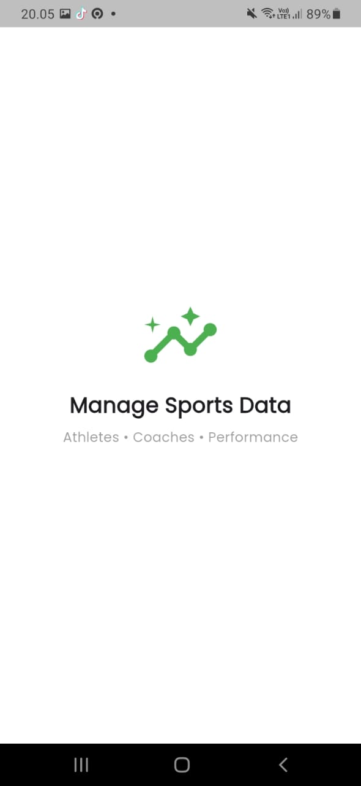
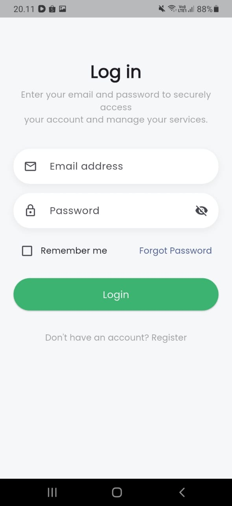
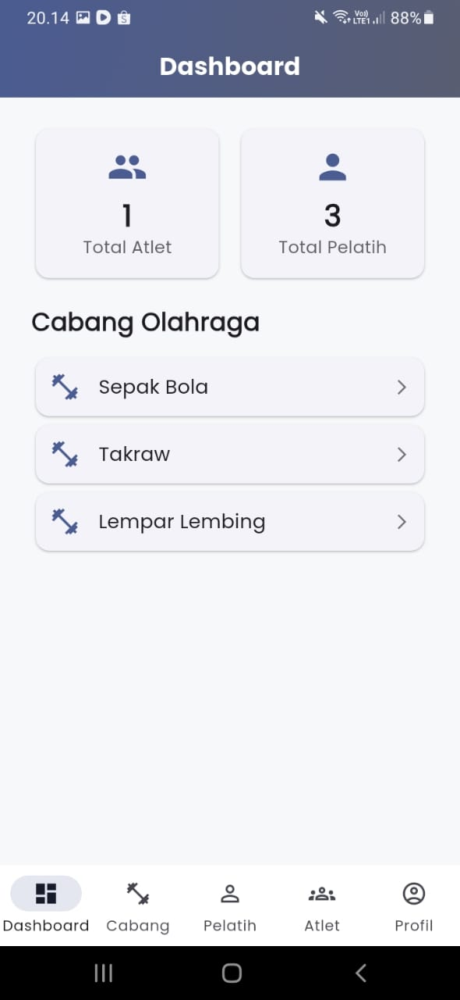
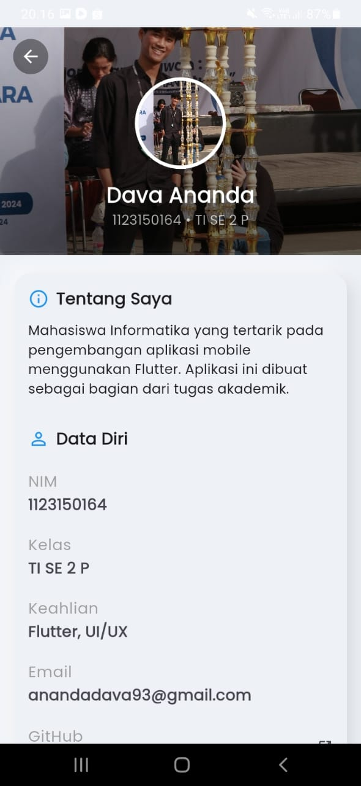
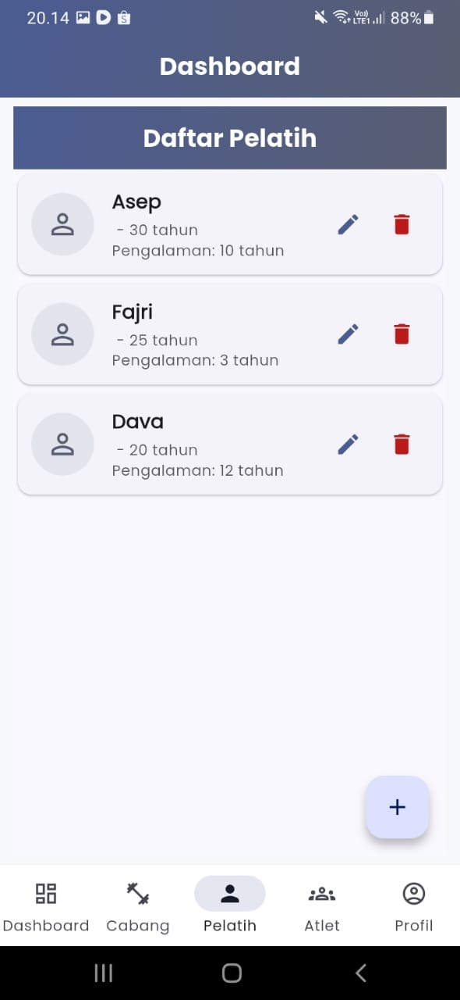
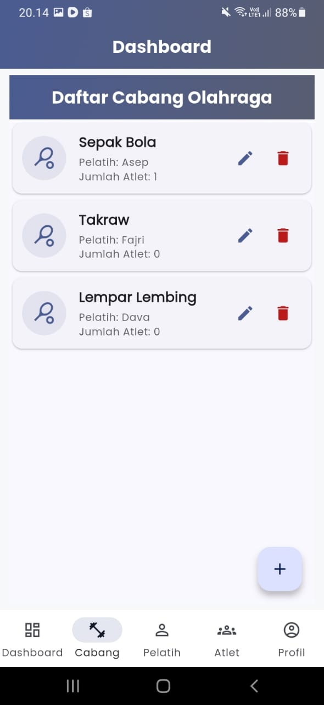

# Atlet Manager

<div align="center">
  
</div>

<div align="center">

Institut Teknologi dan Bisnis Bina Sarana Global  
FAKULTAS TEKNOLOGI INFORMASI & KOMUNIKASI  
https://global.ac.id/

</div>

## 📋 Project UAS

- **Mata Kuliah** : Aplikasi Mobile
- **Kelas** : TI SE 23 P 2
- **Semester** : GANJIL
- **Tahun Akademik** : 2025 - 2026

## 📖 About The Project

**Atlet Manager** adalah aplikasi manajemen olahraga yang memudahkan pengelolaan data pelatih, atlet, dan cabang olahraga. Aplikasi ini dirancang untuk membantu klub atau organisasi olahraga agar administrasi menjadi lebih efisien dan terstruktur.

### ✨ Key Features

- **Modern UI/UX Design** - Antarmuka yang clean dan user-friendly
- **Manajemen Pelatih** - Kelola data pelatih dengan mudah dan terstruktur
- **Manajemen Atlet** - Database lengkap atlet beserta profil dan prestasi mereka
- **Cabang Olahraga** - Kategorisasi atlet berdasarkan cabang olahraga
- **Push Notifications** - Reminder untuk jadwal latihan dan event penting
- **Cloud Sync** - Sinkronisasi otomatis dengan Firebase Realtime Database
- **Dark Mode** - Theme gelap untuk kenyamanan mata
- **Search & Filter** - Pencarian cepat data pelatih dan atlet
- **Offline Mode** - Akses data tanpa koneksi internet

## 📱 Screenshots

<div align="center">
  
  
  
  
</div>

<div align="center">
  
  
  
  
</div>

## 🎥 Demo Video

Lihat video demo aplikasi kami untuk melihat semua fitur dalam aksi!

**[Watch Full Demo on YouTube](https://youtube.com/watch?v=YOUR_VIDEO_ID)**

Alternative link: **[Google Drive Demo](https://drive.google.com/file/d/YOUR_FILE_ID/view)**

## 📥 Download APK

Download versi terbaru aplikasi Atlet Manager:

### Latest Release v1.0.0

- [**Download APK (18.5 MB)**](https://github.com/KbDevs12/mobile_task/releases/download/v1.0.0/atlet-manager-v1.0.0.apk)

**Minimum Requirements:**

- Android 6.0 (API level 23) or higher
- ~25MB free storage space

## 🛠️ Built With

- **[Flutter](https://flutter.dev/)** - UI Framework
- **[Dart](https://dart.dev/)** - Programming Language
- **[Firebase](https://firebase.google.com/)** - Backend & Authentication
- **[Firebase Realtime Database](https://firebase.google.com/products/realtime-database)** - Cloud Database
- **[Provider](https://pub.dev/packages/provider)** - State Management

## 🚀 Getting Started

### Prerequisites

Pastikan Anda sudah menginstall:

- Flutter SDK (3.16.0 or higher)
- Dart SDK (3.2.0 or higher)
- Android Studio / VS Code
- Git

### Installation

1. Clone repository

```bash
git clone https://github.com/KbDevs12/mobile_task.git
cd mobile_task
```

2. Install dependencies

```bash
flutter pub get
```

3. Setup Firebase

```bash
# Download google-services.json dari Firebase Console
# Place in android/app/
cp path/to/google-services.json android/app/
```

4. Run aplikasi

```bash
flutter run
```

### Build APK

```bash
# Debug APK
flutter build apk --debug

# Release APK
flutter build apk --release

# Split APK by ABI
flutter build apk --split-per-abi
```

## 📁 Project Structure

```
lib/
├── main.dart                          # Entry point
├── firebase_options.dart              # Firebase configuration
├── components/                        # Reusable components
│   ├── profile_dev_1.dart
│   ├── profile_dev_2.dart
│   ├── profile_dev_3.dart
│   └── profile_dev_4.dart
├── models/                            # Data models
│   ├── atlet.dart                    # Model Atlet
│   ├── cabang_olahraga.dart          # Model Cabang Olahraga
│   └── pelatih.dart                  # Model Pelatih
├── providers/                         # State Management
│   ├── cabang_olahraga_provider.dart
│   └── pelatih_provider.dart
├── screen/                            # UI Screens
│   ├── biodata_dava.dart
│   ├── crud_menu_screen.dart
│   ├── dashboard_content.dart
│   ├── dashboard.dart
│   ├── detail_profil_adit.dart
│   ├── detail_profil_dimas.dart
│   ├── detail_profil_fajri.dart
│   ├── home_page.dart
│   ├── login_page.dart
│   ├── main_screen.dart
│   ├── profile.dart
│   ├── register_page.dart
│   ├── splash_adit.dart
│   ├── splash_dimas.dart
│   ├── splash_fajri.dart
│   └── SplashScreen.dart
├── services/                          # Business logic
│   ├── atlet_service.dart
│   ├── cabang_olahraga.dart
│   ├── local_notification_service.dart
│   └── pelatih_service.dart
├── utils/                             # Utilities & helpers
│   └── notifikasi.dart
├── views/                             # Additional views
│   ├── add_edit_atlet_screen.dart
│   ├── add_edit_cabang_olahraga_screen.dart
│   ├── add_edit_pelatih_screen.dart
│   ├── atlet_by_cabang_screen.dart
│   ├── atlet_list_screen.dart
│   ├── cabang_olahraga_list_screen.dart
│   ├── pelatih_detail_screen.dart
│   └── pelatih_list_screen.dart
└── widgets/                           # Custom widgets
    ├── atlet_list_tile.dart
    ├── cabang_olahraga_list_tile.dart
    ├── gradient_app_bar.dart
    ├── gradient_button.dart
    ├── info_card.dart
    ├── loading_skeleton.dart
    ├── pelatih_list_tile.dart
    └── sport_tile.dart
```

## 🔐 Authentication Flow

```
1. Splash Screen (Auto-login check)
   ↓
2. Login Screen / Register Screen
   ↓
3. Home Screen (Dashboard)
   ├── Coach Management
   ├── Athlete Management
   └── Sport Categories
   ↓
4. Profile & Settings
```

## 🗄️ Database Schema (Firestore)

### Collection: `pelatih`

```json
{
  "pelatih_id": {
    "cabangOlahraga": "string", // Contoh: "Laki-laki"
    "jenisKelamin": "string", // Jenis kelamin pelatih
    "nama": "string", // Nama pelatih (contoh: "Asep")
    "pengalamanTahun": "number", // Pengalaman dalam tahun (contoh: 10)
    "umur": "number" // Umur pelatih (contoh: 30)
  }
}
```

### Collection: `cabang_olahraga`

```json
{
  "cabang_id": {
    "kategori": "string", // Kategori cabang olahraga
    "namaCabang": "string", // Nama cabang (contoh: "Sepak Bola")
    "pelatihId": "string", // Reference ke pelatih
    "pelatihNama": "string", // Nama pelatih (contoh: "Asep")
    "tingkat": "string" // Tingkat kompetisi
  }
}
```

### Collection: `atlet`

```json
{
  "atlet_id": {
    "beratBadan": "number", // Berat badan atlet (contoh: 45)
    "cabangAtlet": "string", // Cabang olahraga atlet
    "cabangOlahragaId": "string", // Reference ke cabang_olahraga
    "cabangOlahragaNama": "string", // Nama cabang olahraga
    "jenisKelamin": "string", // Jenis kelamin (contoh: "Laki-laki")
    "nama": "string", // Nama atlet (contoh: "Alexander")
    "tinggiBadan": "number", // Tinggi badan dalam cm (contoh: 180)
    "umur": "number" // Umur atlet (contoh: 23)
  }
}
```

### Collection: `users`

```json
{
  "user_id": {
    "email": "string", // Email user
    "fcmToken": "string", // Firebase Cloud Messaging token
    "fcm_token": ["array"], // Array FCM tokens untuk multi-device
    "updated_at": "timestamp" // Waktu update terakhir
  }
}
```

## 🤝 Development Workflow

1. Fork repository
2. Create feature branch (`git checkout -b feature/AmazingFeature`)
3. Commit changes (`git commit -m 'Add some AmazingFeature'`)
4. Push to branch (`git push origin feature/AmazingFeature`)
5. Open Pull Request

## 👥 Team Members & Contributions

### Development Team

| Name                     | Role                             | Contributions                                                                                     |
| ------------------------ | -------------------------------- | ------------------------------------------------------------------------------------------------- |
| **Aditya Putra Perdana** | Project Lead & Backend Developer | - Authentication system<br>- Firebase integration<br>- Database design<br>- API development       |
| **Dava Ananda**          | Frontend Developer               | - UI/UX Design<br>- Home screen implementation<br>- Coach & Athlete screens<br>- State management |
| **Fajri Khaerullah**     | Full Stack Developer             | - Splash screen<br>- Register screen<br>- Notification system<br>- Push notifications (FCM)       |
| **Dimas Prasetyo**       | Mobile Developer                 | - Login screen<br>- Sport category management<br>- Search & filter features<br>- Testing & QA     |

## 📄 License

This project is licensed under the MIT License - see the [LICENSE](LICENSE) file for details.

## 🙏 Acknowledgments

- [Flutter Community](https://flutter.dev/community) - For amazing packages
- [Firebase](https://firebase.google.com/) - For backend services
- [Flaticon](https://www.flaticon.com/) - For app icons
- Institut Teknologi dan Bisnis Bina Sarana Global - For academic support

---

<div align="center">
  <p>Made with ❤️ by Atlet Manager Team</p>
  <p>© 2026 Atlet Manager. All rights reserved.</p>
</div>
